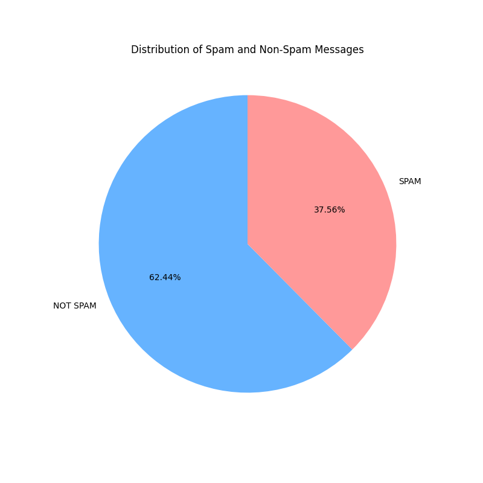

# SMS Spam Detection

This project aims to detect SMS spam messages using a Bi-LSTM model with an attention mechanism. The project includes a **FastAPI** backend for predictions and a **Streamlit** frontend for user interaction. The system is containerized using **Docker** for easy deployment.

## 🚀 Features

- **Spam Detection**: Uses **Bi-LSTM with Attention** for classification.
- **FastAPI Backend**: Exposes an API endpoint for real-time SMS spam classification.
- **Streamlit Frontend**: User-friendly web interface to test predictions.
- **Docker Support**: Easily deployable with Docker and Docker Compose.
- **Data Preprocessing**: Includes stopword removal, tokenization, and TF-IDF vectorization.
- **Model Training**: Supports Naive Bayes and LSTM-based models.
- **Dataset Handling**: Downloads and processes datasets automatically.

---

## 📁 Project Structure

```
sms-spam-detection/
├── data/                 # Datasets for training and evaluation
│   ├── dataset.csv       # SMS spam dataset
│   ├── enron_spam_data.csv # Enron spam dataset
│   ├── merged_spam_ham.csv # Preprocessed dataset
├── models/               # Saved models and vectorizers
│   ├── sms_spam_model.h5 # Trained Bi-LSTM model
│   ├── tfidf_vectorizer.pkl # TF-IDF vectorizer
│   ├── tokenizer.pkl     # Tokenizer for LSTM model
├── notebooks/            # Jupyter(Goole Colab) notebooks for EDA and training
├── plots/                # Generated data visualization plots
├── src/                  # Source code directory
│   ├── data_preprocessing.py  # Data preprocessing script
│   ├── model_training.py      # Model training script
│   ├── model_evaluation.py    # Model evaluation script
│   ├── plot_generation.py     # Generates word clouds and heatmaps
│   ├── api.py                 # FastAPI backend
│   ├── streamlit_app.py        # Streamlit frontend
├── requirements.txt      # Dependencies list
├── Dockerfile            # Docker configuration file
├── docker-compose.yml    # Docker Compose configuration file
├── README.md             # Project documentation
```

---

## 📊 Dataset

The dataset used for this project consists of SMS messages labeled as either "spam" or "ham" (not spam). The dataset is a combination of multiple sources, including:

- `dataset.csv`
- `enron_spam_data.csv`
- `sms.tsv`

---

### 📈 Data Distribution

Here is the distribution of spam and non-spam messages in the dataset:



The pie chart shows the proportion of spam and non-spam messages in the dataset.

---

## 🛠️ Setup Instructions

### **1️⃣ Prerequisites**

Before running the project, ensure you have the following installed:

- **Python (>=3.8)** - [Download here](https://www.python.org/downloads/)
- **Docker Desktop** (for containerized setup) - [Download here](https://www.docker.com/products/docker-desktop)
- **Git** (for cloning the repository) - [Download here](https://git-scm.com/downloads)

Verify installations by running:

```sh
docker --version
docker-compose --version
python --version
```

---

### **2️⃣ Clone the Repository**

```sh
git clone git@github.com:mesubash/sms-spam-detection.git #SSH
cd sms-spam-detection
```

---

### **3️⃣ Create & Activate Virtual Environment**

#### **On Windows:**

```sh
python -m venv env
env\Scripts\activate
```

#### **On macOS/Linux:**

```sh
python3 -m venv env
source env/bin/activate
```

---

### **4️⃣ Install Dependencies**

```sh
pip install -r requirements.txt
```

---

### **5️⃣ Run Data Preprocessing & Model Training**

Navigate to `src/` and execute the scripts:

```sh
cd src
python data_preprocessing.py
python model_training.py
python plot_generation.py
```

This will:

- Download datasets (if not already available).
- Preprocess text data and save it in `data/`.
- Train models and save them in `models/`.
- Generate data visualizations in `plots/`.

---

## 🚀 Running the Application

### **1️⃣ Run the FastAPI Backend**

```sh
cd src
uvicorn api:app --host 0.0.0.0 --port 8000 --reload
```

Once running, access the API documentation at:

- Swagger UI: [http://127.0.0.1:8000/docs](http://127.0.0.1:8000/docs)

---

### **2️⃣ Run the Streamlit Frontend**

```sh
streamlit run src/streamlit_app.py
```

This will open a web interface to test the spam detection model.

---

## 🐳 Running with Docker

### **1️⃣ Build Docker Images**

```sh
docker-compose build
```

### **2️⃣ Start Services**

```sh
docker-compose up
```

- The **FastAPI backend** will run on `http://localhost:8000`
- The **Streamlit frontend** will be accessible at `http://localhost:8501`

To stop services, press `Ctrl+C` or run:

```sh
docker-compose down
```

---

## 📊 Model Performance

The Bi-LSTM model achieved the following metrics on the test set:

| Model          | Accuracy | Precision | Recall | F1 Score |
| -------------- | -------- | --------- | ------ | -------- |
| Naive Bayes    | 92.3%    | 85.4%     | 96.1%  | 90.4%    |
| Bi-LSTM + Attn | 95.67%   | 95.54%    | 92.25% | 93.86%   |

---

## 📤 API Endpoints

| Method | Endpoint    | Description                      |
| ------ | ----------- | -------------------------------- |
| `POST` | `/predict/` | Predict if an SMS is spam or not |

Example request:

```json
{
  "text": "Congratulations! You've won a free iPhone. Click here to claim."
}
```

Example response:

```json
{
  "prediction": "SPAM",
  "confidence": 0.98
}
```

---

## 💡 Future Improvements

- Improve model generalization with additional datasets.
- Deploy on **Hugging Face Spaces** or **AWS Lambda** for public use.
- Optimize FastAPI and Streamlit for better user experience.

---

## 🤝 Contributing

Want to improve this project? Feel free to fork and submit a PR!

1. Fork the repo
2. Create a new branch (`git checkout -b feature-xyz`)
3. Commit changes (`git commit -m "Added new feature"`)
4. Push to GitHub (`git push origin feature-xyz`)
5. Submit a pull request!

---

## 📜 License

This project is licensed under the **MIT License**. Feel free to modify and use it for your own purposes.

---

## 📧 Contact

For any queries, reach out via:

- GitHub Issues
- Email: [subashdhamee@gmail.com](mailto\:subashdhamee@gmail.com)

---

🌟 **If you found this project useful, don't forget to give it a star on GitHub!** 🚀
